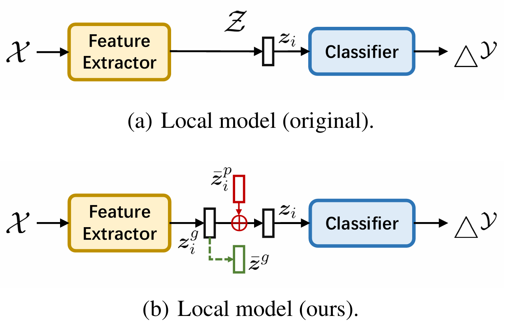

# Introduction

This is the implementation of our paper *[Eliminating Domain Bias for Federated Learning in Representation Space](https://arxiv.org/abs/2311.14975)* (accepted by NeurIPS 2023). It can improve bi-directional knowledge transfer between the server and clients. We show the code of the representative FedAvg+DBE (`FedDBE`). 

- [[NeurIPS] DBE.pptx](./[NeurIPS]%20DBE.pptx)
- [DBEPoster.pdf](./DBEPoster.pdf)

**Takeaway**: locally store biased knowledge in the personalized vector PRBM (red). See below:



**Citation**

```
@article{zhang2023eliminating,
  title={Eliminating domain bias for federated learning in representation space},
  author={Zhang, Jianqing and Hua, Yang and Cao, Jian and Wang, Hao and Song, Tao and Xue, Zhengui and Ma, Ruhui and Guan, Haibing},
  journal={Advances in Neural Information Processing Systems},
  volume={36},
  year={2023}
}
```

# Datasets and Environments

Due to the file size limitation, we only upload the fmnist dataset with the default practical setting ($\beta=0.1$). Please refer to our project [PFLlib](https://github.com/TsingZ0/PFLlib) for other datasets and environments settings. 


# System

- `main.py`: configurations of **FedDBE**. 
- `run_me.sh`: command lines to start **FedDBE**. 
- `env_linux.yaml`: python environment to run **FedDBE** on Linux. 
- `./flcore`: 
    - `./clients/clientDBE.py`: the code on the client. 
    - `./servers/serverDBE.py`: the code on the server. 
    - `./trainmodel/models.py`: the code for models. 
- `./utils`:
    - `data_utils.py`: the code to read the dataset. 

# Training and Evaluation

All codes corresponding to **FedDBE** are stored in `./system`. Just run the following commands.

```
cd ./system
sh run_me.sh
```
